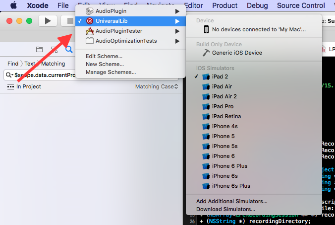

# staRt-ionic
staRt as a (potentially) cross-platform speech therapy app, powered by Ionic

## Installation

The start-ionic app has two parts: an web plugin that manages everything audio related, and an Ionic app that comprises the interface. The audio plugin must be built separately before it can be loaded into the main app

### First time setup
Before you can do anything, you need to install and setup a few dependencies. First, you'll need Ionic version 3. Follow the instructions at http://ionicframework.com/getting-started/, which boil down to running

```
npm install -g cordova ionic@3.19.1
```
Next you'll need the TheAmazingAudioEngine submodle, so run

```
git submodule update --init
```
This downloads TheAmazingAudioEngine as a git submodule. You will also need to have node and bower installed, so install these however is appropriate for your platform. Next, download all of the dependencies from npm and bower

```
cd staRt
npm install
bower install
```

Finally, add the iOS platform, which you need to build the audio plugin

```
ionic platform add ios
```

There may be a couple of errors or something, don't sweat it.

### Building the plugin

```
open audio-plugin/src/ios/AudioPlugin/AudioPlugin.xcodeproj
```
The audio plugin Xcode project has a couple of different targets. You can see all of the different targets by clicking near the top of the window next to the stop button.



- The UniversalLib target is the one to build before running the app. This will build a version of the audio plugin that targets both the simulator as well as iOS itself. You need to build this before running the app for the first time, as well as anytime you change the audio plugin
- The AudioPluginTester target is a very small iOS app that runs the AudioPlugin and draws it using Cocoa. It's a good way to test out new audio processing functionality.

So, to build the plugin, simply select the UniversalLib target and build it.

### Adding Credentials
The production server is password protected. Therefore, you'll need to create a JSON file `staRt/www/data/credentials.json` with the following format:
```json
{
	"username": "<the_username>",
	"password": "the_password"
}
```
This file is in the `.gitignore` so that the username and password will not be accidentally uploaded to Github. It is important to have this file so when the Ionic application is built, the username and password will be included. To get the username and password, just ask someone.

### Installing the audio plugin

Most cordova plugins can be installed by simply running

```
ionic plugin add <plugin-name>
```

The local audio plugin must be installed like so

```
ionic cordova plugin add ../audio-plugin
```

otherwise the plugin will not install correctly. Whenever you change the plugin, it may be necessary to uninstall and reinstall the plugin.

### Buliding the ionic app

```
npm install
bower install
```
This downloads and installs all of the project javascript dependencies. You should only need to do this when you first set up the repository, or whenever you install a new package with npm or bower.

```
cd staRt
ionic cordova platform add ios
```

This creates an xcode project at `platforms/ios`. This Xcode project is what you use to build and run the app, as well as to upload it to the App Store.

```
open platforms/ios/staRt.xcworkspace
```
Will open the workspace to run. Then choose your target (simulator or iOS) and run at your leisure. If you make a change to any of the code, you need to run
```
ionic cordova prepare
```

in order to copy the changed files into the application bundle. Otherwise, you may find that changes you make to files in `www` do not propage to the compiled version of the iOS app.

```
ionic serve
```
Is useful if you want to run the app in a browser. This will open a web browser that serves the app. The nice thing about the web browser is that it has live reload, which means that whenever you change something in the ionic app, the web page will automatically reload to display your changes. The only downside is that it can't display the LPC, since that requires the web plugin which only runs in iOS or in the simulator. If you want to run the app in the simulator or on a device, you'll have to open and run the xcode project.

### Updating the app version

When you need to bump the application version, change the appropriate value in `staRt/config.xml` and rebuild the xcode project. Don't change the value in `staRt.xcodeproj` directly.

### Workflows
#### Changing the audio plugin
- Make some change to the audio plugin
- Rebuild the UniversalLib target
- ```cd staRt```
- ```ionic cordova prepare```
- ```open platforms/ios/staRt.xcodeproj```
- Build and run the app for the simulator or device

#### Changing the ionic container app with live reload
- ```ionic serve```
- Make some change to the container app
- Changes should be reflected immediately

#### Changing the ionic container app in the simulator
- Make some change to the container app
- ```ionic build```
- ```open platforms/ios/staRt.xcodeproj```
- Build and run the app for the simulator or device

#### Linting  
To lint before submitting a PR,  
`$ ./node_modules/.bin/eslint /www/path-to-your-component/*.js`

or, if installed globally: 
`$ eslint ./www/path-to-your-component/*.js`

[eslint rules reference](https://eslint.org/docs/rules/)


## Directory Structure

- audio-plugin
	- src --- Source files for the audio plugin, including the audio processing code
	- www --- Javascript interface for the audio plugin (how the ionic app talks to the native code)
	- plugin.xml --- Configuration file for the plugin
- flask-upload --- Python application that can be used to test file upload
- staRt
	- www --- Main source code of the ionic app. Make all your changes in here
		- css --- Application styles
		- data
			- `staRt_wordlist.csv` --- List of R words for practice
			- `F3r_norms_Lee_et_al_1999.csv` --- List of F3 norms for various ages and genders
		- common-components
			- lpc-directive --- LPC drawing code lives here
			- profile-service --- Saving and loading user profiles
		- states --- All of the application drawing code and logic
			- root
				- free-play
				- profiles
				- resources
				- words
				- tutorial
				- auto
				- syllables   
